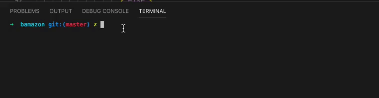

# bamazon

This is a command line interface tool that imitates an online store. It talks to a MySQl database and updates infentory based on imput given. If you do not want to buy something now you will later.
 

 

Here is a video link to a walkthrough.
 

                                        
    
